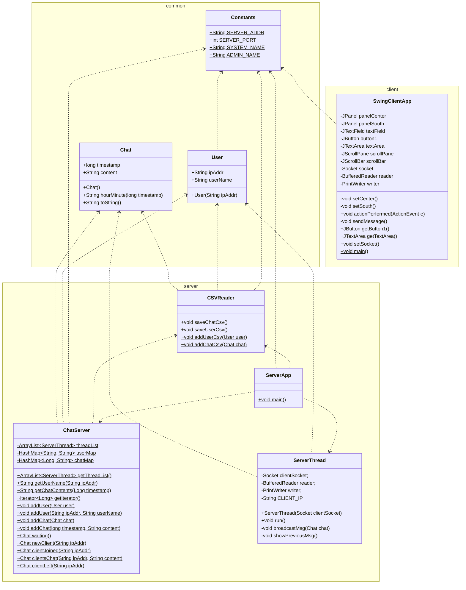

# StrangeChat
## 01 개요
1. 로컬 네트워크 내에서 이용 가능한 채팅 앱
2. 진행 기간 시작: 2023-12-17 종료: 2023-12-22
3. GitHub Repository https://github.com/suyons/StrangeChat
4. 참여 인원

    | 이름 | 프로필 | 역할 |
    | :-: | :-: | --- |
    | <b>김수영</b> | [@suyons](https://github.com/suyons) | 1️⃣ 서버, 클라이언트 기본 기능 2️⃣ 소켓, 멀티스레드, 스트림 |
    | 박지은 | [@parkje72](https://github.com/parkje72) | 1️⃣ 서버 파일 입출력 기능 |
    | 이수진 | [@WGCAT](https://github.com/WGCAT) | 1️⃣ 클라이언트 GUI 구현 |
    | 황태윤 | [@taeyounh](https://github.com/taeyounh) | 1️⃣ 클라이언트 명령어 기능 |

## 02 사용 기술

| 구분 | 항목 | 목적 |
| :-: | :-: | --- |
| 서버 | Java | 대화 내용 저장 및 모든 클라이언트에게 broadcast |
| 클라이언트 | Java Swing | (GUI) 서버로부터 전달받은 메시지의 내용을 표시 |
| 협업 | GitHub | git 기본적인 이용 방법 학습 - Repository 생성 및 clone, commit & push 등 |

## 03 구성도
**UML Class Diagram**

## 04 구현 기능

## 05 코드 소개

## 06 돌아보며