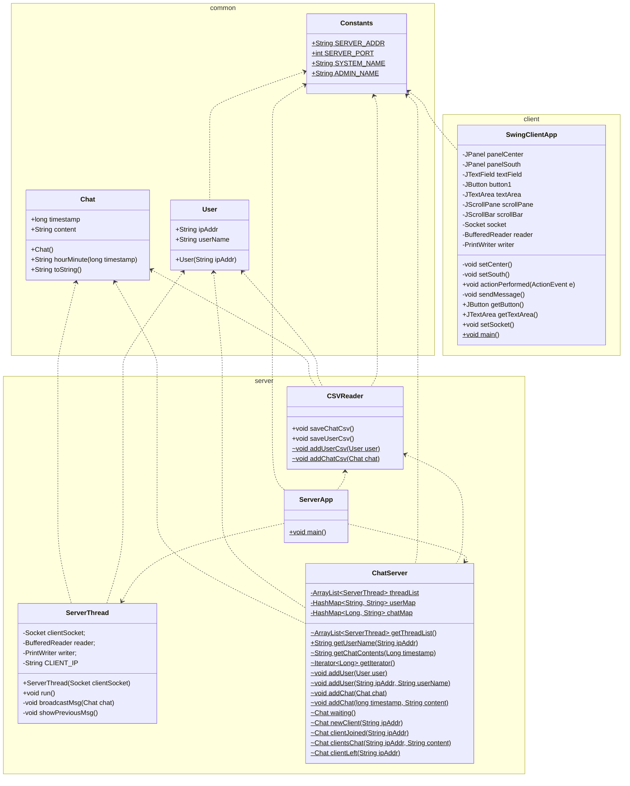

# StrangeChat
## 01 개요
1. 로컬 네트워크 내에서 이용 가능한 채팅 앱
2. 진행 기간
   * 시작: 2023-11-17
   * 종료: 2023-11-22
3. GitHub Repository
   * https://github.com/suyons/StrangeChat``
4. 참여 인원

    | 이름 | 프로필 | 역할 |
    | :-: | :-: | --- |
    | <b>김수영</b> | [@suyons](https://github.com/suyons) | 1️⃣ 서버, 클라이언트 기본 기능 2️⃣ 소켓, 멀티스레드, 스트림 |
    | 박지은 | [@parkje72](https://github.com/parkje72) | 1️⃣ 서버 파일 입출력 기능 |
    | 이수진 | [@WGCAT](https://github.com/WGCAT) | 1️⃣ 클라이언트 GUI 구현 |
    | 황태윤 | [@taeyounh](https://github.com/taeyounh) | 1️⃣ 클라이언트 명령어 기능 |

5. 개발 목적
   * Java 기본 이론 학습 이후 적용 훈련
   * 수업에서 학습한 내용
     * 컬렉션 프레임워크: HashMap, List
     * 스트림: BufferedReader, FileReader
     * 다형성: Overloading, Overriding
   * 추가로 학습한 내용
     * Git: clone, pull, commit, push
     * GUI: Swing library
     * TCP/IP 소켓 통신: ServerSocket

## 02 사용 기술

| 구분 | 항목 | 목적 |
| :-: | :-: | --- |
| 서버 | Java | 클라이언트에서 작성한 대화 내용 입출력, 전송 |
| 클라이언트 | Java Swing | GUI, 전송받은 메시지 표시 및 새 메시지 작성 |
| 협업 | GitHub | 개인별 Branch를 생성하여 개별 작업 내역 관리 |

## 03 구성도
**UML Class Diagram**

## 04 구현 기능
### 1. 클라이언트 GUI

### 2. 서버 CSV 파일 입출력

## 05 돌아보며
### 1. 아이디어 기획 과정
